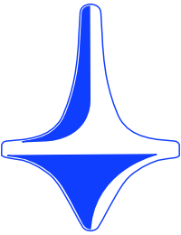
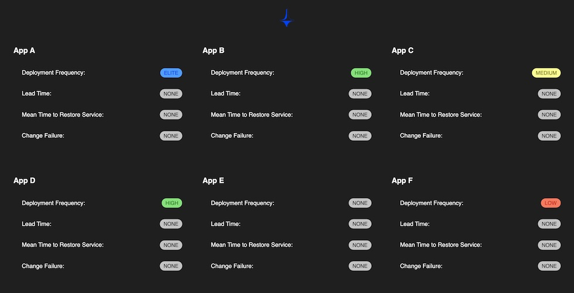

# DORAmeter

> A tool for capturing and reporting DORA metrics

This app is used to capture and display [DORA](https://cloud.google.com/devops/) metrics. It requires a Postgres
database to persist metrics that are reported to it. DORAmeter captures data through a RESTful `POST` request on its
`/events` endpoint, with a payload described below in the [Running Locally](#running-locally) section. It uses GraphQL
to query data for its frontend.

#### Choice of icon 



Like a spinning top, the DORA metrics measure between speed and accuracy. It's speed metrics are Deployment Frequency
and Lead Time. It's accuracy metrics are Mean Time to Restore and Change Failure. Too much focus on speed or accuracy
and your app will degrade in performance. A good balance will keep the top spinning.

### Coverage

| Statements                | Branches                | Functions                | Lines                |
| ------------------------- | ----------------------- | ------------------------ | -------------------- |
|  |  |  |  |

> The above coverage numbers are not accurate because Jest coverage doesn't play nice with integration tests. Coverage
> above 80% on all code structures are still enforced.

### What the metrics are and how they are calculated

#### Deployment Frequency

Deployment frequency (DF) is a measure of how often code gets deployed to production. It indirectly measures the size of
the change being delivered. It has been proven that smaller code changes accelerate feedback, and reduces risk and
overhead.

DF is measured by the difference between the current time and the last time the app was deployed, in hours. The choice
to measure between the current time and last deployment was made because it's rare that an app runs in complete
isolation with no dependencies. It's more likely that your app, like every app, will suffer from
[software rot](https://en.wikipedia.org/wiki/Software_rot) from these dependencies if not continuously updated. In a
later update, I may add the option to measure the time between the two last deployments. Below are rankings for the
difference measured:

| Ranking | Time (in hours) |
|---------|-----------------|
|  | < 24 |
|  | < 168 (1 week) |
|  | < 672 (1 4 week month) |
|  | < 4032 (6 months) |
|  | Not enough data |

#### Lead Time

Lead time (LT) is a measure of time it takes the app to go from code committed to code deployed. Shorter
LT's is significant because they enable faster feedback on what is being built and allows for more rapid course
correction.

Rankings TBD.

#### Mean Time To Restore

Mean time to restore (MTTR) is a measure of the time it takes to restore a failed service. Shorter MTTR means higher
reliability for systems.

Rankings TBD.

#### Change Failure

Change failure (CF) is a measure of the rate of changes to production that fail. A low CF rate is a representation for
the accuracy of the change being made.

`(number of failed changes)/(number of successful changes) x 100`

Rankings TBD.

### Running Locally

1. Start with `yarn` and `yarn dev` (Uses Docker to start up app and dependencies)
2. To add data you can run `yarn migrate-seed-data` or by making the following HTTP request:
```
POST localhost:4444/event
JSON Request Body:
{
  "appName": "App J",
  "buildId": "someBuildId12345",
  "eventType": "DEPLOYMENT" (To be implemented: "CODE_COMMITTED", "SUCCESSFUL_TEST", "UNSUCCESSFUL_TEST")
}
```
3. Visit `http://localhost/` on a browser to view the frontend for DORAmeter



This API saves events through a RESTful API and will query those saved events through GraphQL for its frontend. To see 
the raw data for the UI:
1. Visit `http://localhost:4444/graphql` to view the Apollo's GraphQL Playground
2. To retrieve all apps' deployment frequency make the following query:
```graphql
 query getAllAppsDeploymentFrequency {
    apps {
        deploymentFrequency {
            lastDeploymentTimestamp
            rating
        }
    }
}
```

### TODO

There's still some work left. I need to add the capability to report on:
* Lead Time
* Mean Time To Restore
* Change Failure

This project is also being used to try few opinions found 
[here](https://github.com/brigonzalez/DORAmeter/wiki/Opinions)
